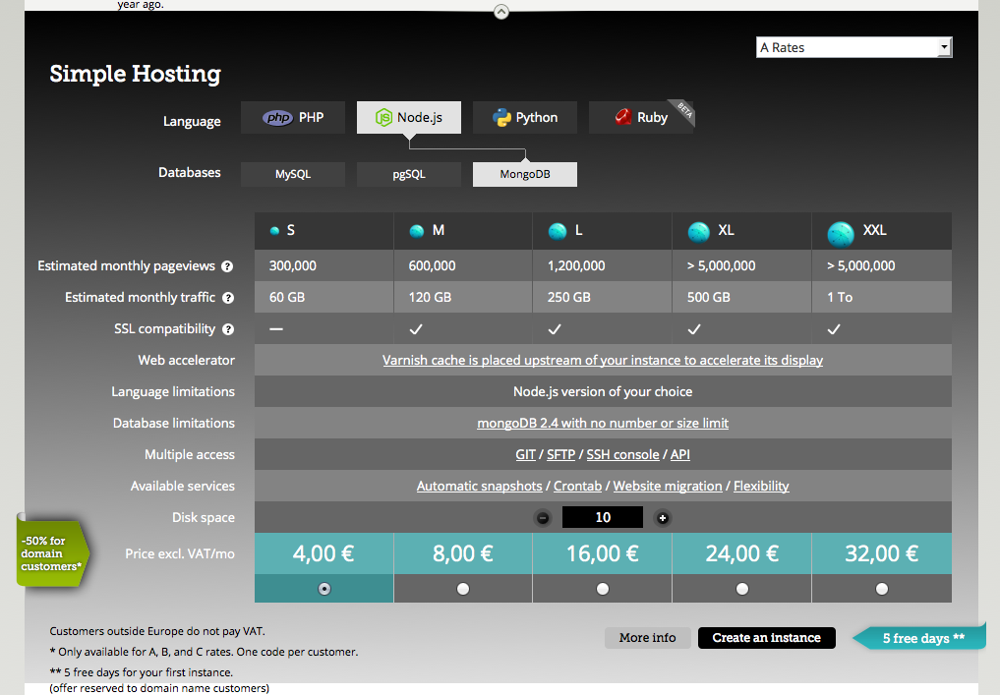
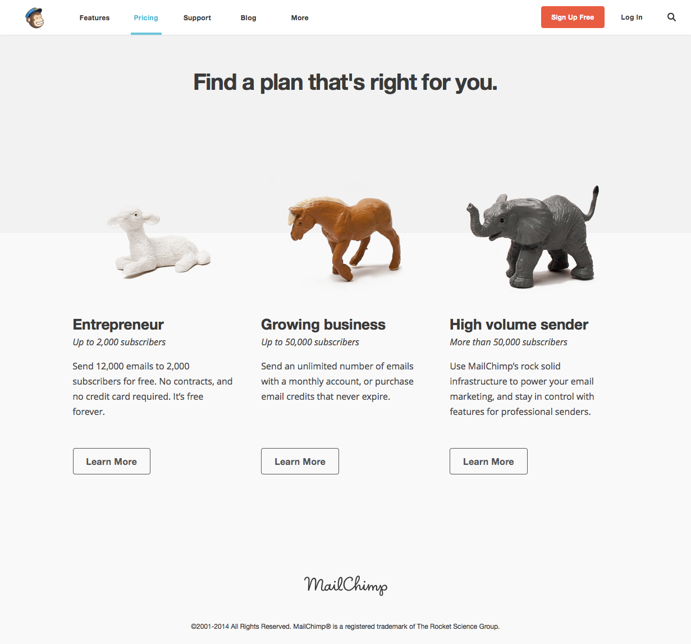
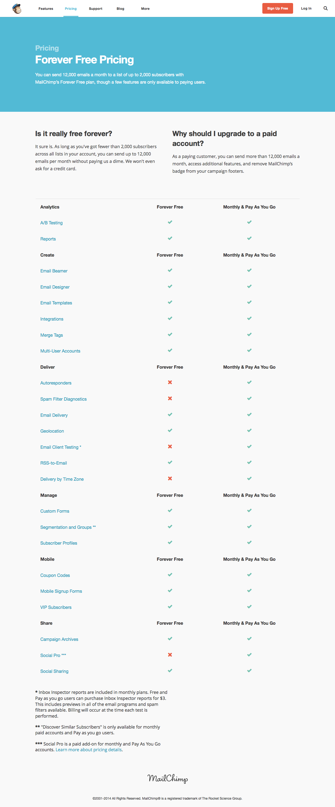
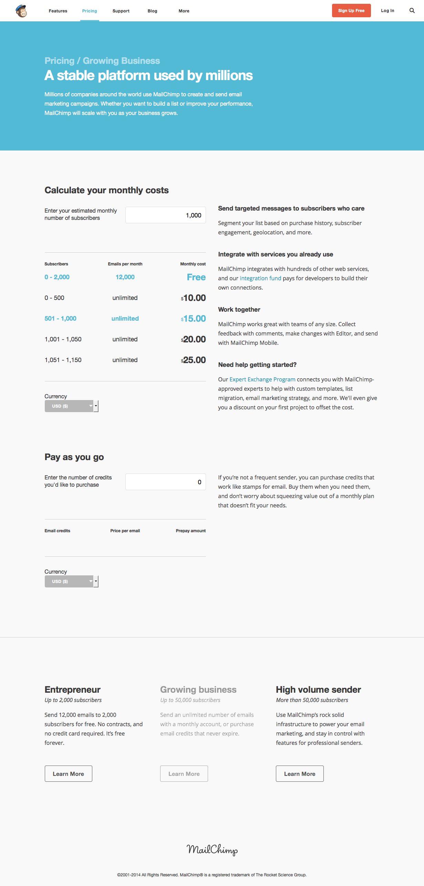

= A Coders Guide to SaaS-App-Pricing =
:Author: Benjamin Kampmann
:Email: ben@create-build-execute.com
:Date: July 1st, 2014
:Revision: 0.9
:stylesdir: stylesheets/
:stylesheet: scribe.css

== Introduction ==

Welcome to this short guide on pricing Software as a Service (Saas). The main goal of the guide is to help you decide how to create different packages for your service and what to charge for each -  without getting lost in all the buzzwords. It'll start by laying down the basics and then looks at successful software providers for further examples. 

This guide is for you if you have just written some software that you would like to provide as a service, but you have little experience with selling. If you have no idea what SaaS is, you may want to start reading up on that first!

Before we start, for those of you who are not big on reading, for 80% of the cases the optimal price for your service will be €29.95/month ($36.95/month). This guide will explain you why and for which cases it is different. But if you don't care and just want a number, odds are, this is the number you want.

Enjoy.

=== Changelog ===

As this is supposed to be published primarily online, the document will have updates (in form of continues deployment). This section lists the changes, latest to first.

If you want to stay up-to-date, please navigate to https://github.com/ligthyear/ebook-saas-pricing , log-in (or sign up), click on the "Not watching"-button and select "watching".

**Latest Changes**:

 - 2014-12-29:
   * edit Anouk

 - 2014-07-01:
   * minor restructuring
   * adding more use cases

 - 2014-05-22:
   * minor copyedits
   * copyedit on slack case study

 - 2014-05-21
   * finish first copy edit
   * add slack.com case study for pay-as-you-go-with-plans

 - 2014-05-11
   * latest copy edit
   * fix the build, make publishable

 - 2014-03-12
  * copy edits

 - 2013-12-30
   * first draft

<<<<

== What makes SaaS pricing different ==

=== Low marginal costs ===
One of the main differences of software vis-a-vis physical products is that it is extremely cheap to produce another unit. Making your app available to yet another customer comes at little, or even zero costs to you. That means that, even though you will need to cover the initial costs of building the app, you do not need to take account of the marginal costs when calculating your selling price.

=== Competition ===
In case of Software-as-a-Service, competition is very rarely a race to the bottom – where you try to outsell your competitor by offering ever lower prices for your product. Generally speaking, your (potential) customer would probably be able to find a freely downloadable version of similar software somewhere on the web. Instead, they choose you. Why? Because your service offers a feature that is especially useful for them. Maybe your service is more reliable, better tailored to their needs, easier to use etc. This means that even though other people may be offering a similar service, there is no immediate need to try and out-price them.(basically, if your potential customer downloads the free version instead, you're doing it wrong)

=== Subscription ===
Providing SaaS allows you to offer a subscription model, where your customers pay a monthly fee, instead of a one-off sum. This simple fact has important implications for both marketing and pricing. For one, keeping your customer happy is of vital importance. Secondly, instead of continuously searching for new customers, you could also try to increase your earnings from existing clients by adapting your service to their needs and offering them additional features whenever they outgrow their current package. Obviously, you should include all this in your pricing (see below)!

== Pricing Psychology basics == 

Without the need to out-price the competition, or cover production costs, what should your prices be based on? The simple answer: customer demand. Whatever your customer is willing to pay should be your price, basically. 

Nope. That wasn't very helpful. How are you supposed to figure out what your customer would or would not pay? Luckily, people have done research. 

=== Choice ===

First off, you are not just selling one service. That beautiful piece of software you just wrote has many different features. Features that can be switched on, or off. In addition, once you start talking to your customers you will soon learn that they all have different needs and requirements. Some want more speed, but without the storage, while others may have a need for storage but could do without any syncing. Listen to them too much and you will soon end up with 48 different packages, all with different prices. The sort of chaos you should want to avoid.

Studies into human behavior show that too much choice means we avoid making a decision. Offer your potential customer 48 options and they will pick none. Give them only 3 options, and they are far more likely to subscribe to your service! 

Increase conversion rates even further by making the 3 packages highly comparable. This means that the most expensive version should have all the same features included in the basic package, plus extras. All this information should be easily observable and the three packages should be displayed on a single page.

=== The first package is the hook ===

The lowest priced package is the one you'll use for advertising and marketing. It should cheap, if not super cheap. This is also the (only) package for which you offer a free trial. Both the low price and free trial lower the entry barrier, making it easy for people to start using your service. So, go as low as you can, while still making some money.

What should you offer in this cheap version? Enough to be interesting for new customers. If you've a good feel for your market, you probably know what that entails – otherwise do some market research. At the same time, the cheapest package should be too lightweight for your real customers. For example your customers might be self-employed lawyers acting on 10 court cases at the same time, and your smallest package only allows for 8 court cases. That should be enough to get a good idea of the service, but anyone using it full-time would eventually want to pay more to include all 10 cases.

Once the free trial is over and someone comes back to select a 'real' package, you have got yourself a customer! Now, it should be obvious to them that the cheap version is not enough (again, know your market). This is why you also offer two other packages. By making the cheapest solution irrelevant to your real customer, they immediately move to the second plan, not even questioning whether the competition might offer something better at the same price. In addition, research shows that by selecting the second or third package people enjoy a slight satisfactory feeling of "being higher than just somebody".

=== The second package is good, the third is to settle ===

The second packages offers much more than the lowest one we previously discussed. Not only can your customers run their businesses with it, but it is almost too generous, offers more than they ever feel they'll need, for just about double the initial price.

It is indeed a very good offer, and they _should_ now want to settle settle. Yet, many do not. By offering so much already – essentially all most people would ever want – they become curious about what more you could be offering. And they'll have a look at the third package to compare it to the second.

This it where things get interesting. The third package is usually suggested as a way to get your customer to settle on the second package, however you could probably do better. First off, the price difference between the third and second package should be less than that between the second and the first. Next to that, the third packages should offer something extraordinary, though not necessarily needed (like 10.000 sms per month – no one ever uses that). By adding this glitter and glamour you increase the attractiveness of the third plan by a lot, while staying comparably in-expensive. 

In my experience, the best way to achieve this is by adding exactly one major key feature on top (aside from appropriate scaling parameters). Like in the formerly mentioned lawyer example, a third package couldadd a second account for an office assistant. This adds a lot of value, while the perceived price difference is very small (coincidentally, it comes at almost no costs to you). Ultimately, when comparing the second and third packages, the third becomes much more attractive.

.INCLUDE SOME INFO ON THE ACTUAL PRICES, HOW DID YOU COME UP WITH 29.99?
9.99, 19.99, 29.99??? Tell them to look at compar

.The psychology behind this
NOTE: has been explained very well by link:http://www.youtube.com/watch?v=xOhb4LwAaJk[Dan Ariely on youtube]: we don't know our preferences that well and therefore are receptive to influences like supposedly good offers in comparison to another.

=== Does 9.99 really work? ===

The answer is yes. Humans don't trust rounded numbers (like 10.0) and deem numbers with more decimals more reliable – in the sense that they would be more likely to represent some true price. Obviously, all of this is highly unconscious. In addition, research shows that for some reason (unknown to me, or the researchers) prices that end with a nine outperform every other option (with five and seven right behind, but off by far). This has been shown in a series of studies, like link:http://link.springer.com/article/10.1023%2FA%3A1023581927405[this one from MIT] and discussed in detail in books like link:http://www.amazon.com/dp/080909469X/ref=cm_sw_su_dp["Priceless" by William Poundstone] footnote:[Published at Hill and Wang, 2011, ISBN 978-0809094691]. If you want more detail on that, I recommend reading those for further insight.

=== Selling to enterprises ===

The basic rule goes like this: if the company is big enough to employ someone who's main job it is to buy services like yours, instead of pressing a button on a website, they'll call you up and ask to negotiate a custom pricing plan. Big companies assumes normal pricing plans don't apply to them. Also, the person in charge with subscribing to these services needs to be able to justify their job. 

Obviously, all of this means more work for you. You now need to pick up the phone and negotiate. Let's make sure it's worth the effort! 

During the negotiation you triple your offer and add a big support package on top, which you sell for at least ten times the price you have on your highest plans. That at least puts it back into the price-range that enterprises are used to deal with and happy talk to about: they really rather buy the service for €5.000 than for €50.

That is also why even your highest priced plan should still have limits, it leaves with something to sell to enterprises and high-class customers. Even if during negotiations you settle for eight times the highest plan so they feel they "won" the negotiation with you, it was worth the effort for you. But don't ever think that this is an option to include via a one-click sign-up. Enterprises don't do one-click-sign-up.

Finally, if you expect your service could be interesting to corporate clients, don't forget to add another box on the bottom of your landing page (or somewhere clearly off the comparison table) saying you are open to discuss other pricing options and offer individual pricing for bigger customers or special institutions (like non-profits or education, as Google is doing).

== Upselling without Upsetting

Upselling is one of the most beautiful aspects of SaaS-pricing. The previously discussed pricing strategies are one way of upselling, as you try to move your customers into the higher priced plans. Oftentimes, there are many more ways in which you can upsell your service. 

Sadly, upselling has been abused in the past, like airlines tricking you into getting a "travel insurance" by pre-checking boxes for you. No wonder upselling has gotten such a bad rep. Nonetheless, you can use upselling techniques without being evil. In fact, getting this part right can be of tremendous importance. 

=== How to structure the upsell

Generally speaking, upselling happens right after your customer selected a package and right before they hand over their payment details. At this stage, you often present your customer with a screen that allows them to configure the acquired service – a great time to upsell.

It is not hard to imagine that your customer, who is now in the process of setting up the service, might be interested in configuring more features. Psychologically, as the initial buying phase is behind them, it is unlikely your customer will return to the packages page to figure out whether they can get the same feature as part of another package. They've already settled. 

At this time it is about presenting presenting some additional options in a non-threatening way and allow your customer to "configure" those.

=== What to upsell

In order to be able to upsell, you obviously need to know your numbers and your customers. For upselling the best are those features people think they need, will need soon or want, but which are slightly outside of the main product. 

For instance, in the case of our lawyer, you could allow them to configure more frequent backups of their data (increase to hourly for example) for a little more or allow them to enable encryption (and secure signing) for archived cases. Both are not necessarily the core of the product, but your customers, once reminded that this exists, might well be willing to pay for it. An upsell is always the question of what your customer _needs_, _wants_ and might _want to need_.

_Another example would be the an online radio streaming service, which had a feature allowing to directly stream to the shoutcast service. Shoutcast is an external server that would then handle the distribution of the streams, resulting in their service only having to offer one output stream. It didn't cost them anything – if anything it was cheaper for them as the traffic would go through Shoutcast. But as many (if not all) other competing providers forbid these kind of features to enable a lock-in effect, enabling this feature is a classic thing to upsell with. Not only because more people think they need it than actually ever use it but also as the numbers show plenty people do use it instead of taking the more expensive plan with more streams.

By having to buy this feature extra on the second page, for an additional price, many people were willing to pay a higher total than just getting a plan that costs more but includes more streams and but would cover that, too. People pay for control and convenience._ NEEDS WORK!!

<<<<

== The holy Grail of Pay-as-you-go

The latest addition to the pricing models in the SaaS market is the pay-as-you-go-model. One of the first to offer this on a large scale – and make tons of money with it – was Amazon with its cloud solution Amazon Web Services (AWS). Basically, you'd pay only for what you use in terms of CPU-Cycles, storage and traffic. Unlike many other services which only give you limited resources, this model allows you to easily grow and scale your business. And even though, especially on large scale, Amazon is a very expensive cloud infrastructure, it is still the most widely used and implemented one out there. Leaving analysts puzzled.

This confusion is rooted in a common misunderstanding of the pay-as-you-go model: despite popular believe, the selling point actually isn't the resource itself. What people are effectively buying is flexibility and convenience. Flexibility because most of those services offer a very, very low starting plan: a basic offer that is free in most cases. You can spin up a free instance on AWS within half an hour. For many things, this is enough to get started. Only once a project gains traction and generates traffic, one needs to upgrade to bigger machines and pay for the extra resources used.

At the same time the service is flexible enough to handle peaks for you. Peaks are good for your business, as they usually mean more business. The last thing you want is for your website to shutdown because the package you bought was too small to handle peak traffic. 

Next to that, this model is convenient. In a pay-as-you-go-model you barely need to plan for future growth. The payment grows with the number of customers you have. And although you end up paying a premium once you reach a certain threshold -as price is always directly linked to the amount of customers you have- it is easy to pass costs on to your own customer. 

=== Applied to Plans
Thinking back of the plans we talked about before, how does that integrate in a pay-as-you-go-model? Amazon has been pioneering here as well, with a feature they call "reserved instance hours". It boils down to a classic and old principle: the discount if you buy a lot and pay upfront.

Basically instead of being charged for every minute you use, you say at the beginning of a period that you'll pay for at least 2 full CPU months and Amazon gives you that for a discount. If you don't use them, you pay too much but if you do, you don't pay as much as for the normal pay-as-you-go. If you need more resources than that, you often pay a discounted price on those extra resources, too. Not as good as the offer for the reserved resource but still cheaper than if you hadn't reserved at all.

So, if there is any way that you can create billable timed resources through your service, this is the model you want to go for. Going back to the radio streaming example from before: one stream hour could be such a resource – every hour that one persons listens to a stream. Now on the lowest plan, you'd have to pay nothing, get 1.000 StreamHours included but every stream hour after is at 10 ¢ - this would account for a little more than one full-time-listener but is enough to try the service and see if it works for you. As the previously mentioned shoutcast-streaming feature is excluded in this plan,  this isn't a long-term option for you. But 10 ¢ per stream per person per hour also doesn't sound too much to pay.

The second plan now costs, let's say 39 €, includes 5.000 StreamingHours and every hour on top costs another 8 ¢. The next higher plan includes 15.000 at 79 € at 6 ¢ the extra hour and the one for 99 € contains 50.000 StreamingHours with any hour after being as cheap as 2 ¢. This is only a calculation example and doesn't necessarily work in the real world but it illustrates the idea. Because the concept of plans still works here, with the special feature that you can even offer a plan of 0€ you make money with. Might even make more money than with the other plans because of the higher per-hour-price.

The reason why you still want the other plans though, should be obvious. Aside making business predictions easier, you can also reward your customers on their success. Instead of making it the experience of "well, you had so many streams, we had to cut your services", you can make it the story of "Congratulations on your peak of listeners last week. We just wanted to let you know, for successful Radio Streams like yours our plan B has a pricing system, with which you've saved 100 € this month alone already.". You become part of their success story, a supporter and helper on the way. Not the technology that failed on them during the best stream of their lifetime.

Through this model suddenly you are also much more interested in the numbers of each and every client and love to serve them to optimize those, give them insights and dashboards, even live stats to make them do their job better. And once you understood this mechanic behind the curtains, it becomes obvious why Amazon is so successful. It isn't because of their resources, it is because of the business model implemented through their pricing scheme.

>>>>>

== Case Studies

Let's take a look how the previously mentioned methods and concepts are applied in real life by SaaS Companies.

=== Gandi.net

Gandi.net is a Domain name registrar and cloud hosting provider. They became very famous in developer circles for their no-bullshit rules applied to everything, including their customer service.

Though Gandi's main product is domain registration and hosting, they don't really master good pricing here – it is highly competitive and complex. But on their mid-level Platform-as-a-Service-Hosting solution, they do the job very well. Let's take a look on what how they are doing it. With that service you can easily deploy PHP, Python, Node or Ruby project on one of three pre-selectable database engines without having to bother too much about setup and configuration.Here's what their plans overview looks like:

Do you remember when we talked earlier about having a low-end-base-price that is okay and totally fine but misses _one_ important feature? Take a look at the difference between the plans S and M. Not only is M double the size but more importantly S doesn't support SSL at all. Even if you are just running a rather small website, as long as there is some handling of sensitive information, you want SSL-Support. So without further notice only M and higher are of interest to you.

As previously stated, Gandi is very proud about their "no bullshit" rule. Which they also applies to this screen. It is clean and clear, the prices are full numbers and are practically bound to the fact you get double the service. But do you? The switch from M to L, though costing the double actually gives you more than just double. Sure, 250 GB is only 10 GB more than twice the 120 that M offered, but it is more none the less. And though subtle, if you are really checking the prices, you will notice and it will make you curious what they do at the next plan. Where they – all of the sudden – don't only offer the expected 2.4M page views but **over** 5M. And for a price just about 50% more than L. M already looked like the better offer already, but now XL just became the real bargain on this page.

Briefly I'd like to mention that the increasing the disk size does increase the price transparently about the same amount on all prices (90¢ per 5GB). And on the top right, you can configure the discount you get after you've been doing business with them. Clean and clear, no bullshit and still applying a good pricing scheme

=== MailChimp

MailChimp is an email marketing service company, known for its really cute marketing with all kinds of monkeys. Right from its beginning in 2001 MailChimp has only been available as an online service. Aside from email-delivery and tracking they are praised for enabling their customers to create good looking and well working email newsletter through a very empowering user interface. Let's take a look at their pricing system. This is what you see, when you click on the main menu item "pricing":

Before talking numbers, MailChimps makes you rethinking what business you are and what kind of service you'll need. Are you an entrepreneur, requiring up to 12k emails a month? Or a growing business with higher demands? Or are a fortune 500 in need to have huge demands full filled? Did you notice how they changed the conversation from money to a conversation about the customer and their needs? You aren't thinking about what prices are appropriate or what you are willing to pay, you are thinking about your business and its needs. Only after you've opted in describing your request a little more you will be presented with an actual offer. Let's take a look at those, each one by one.

==== The Entrepreneur

MailChimp is using a very positive language everywhere. Even when talking about the long-tail, the part of business that is of low volume, they are using terms that make the customer feel good and special. Being small is bad, being an aspiring entrepreneur is good. This is also transferred when you look at the page after selecting you were an entrepreneur:

image::image/mc-entrepreneur.png[scaledwidth="80%",align="center",alt="Mail Chimp's Entrepreneur Pricing"]

Clean and clear and still not really about numbers. MailChimp really internalised the understanding that the pricing page is still a part of selling and marketing their service to the customer. As a result, this page, too, has comparably a lot of text and tries to convince you about their service and how it is totally suited for you and your business case. The only thing it really features is one big red button telling you their service is free for you. Which is something they, as with so many Software-as-a-Services, can afford easily. Once self-signup is in place, the costs per new customer are almost non existent – in case of MailChimp, sending another 12k emails a month isn't a bother at all for their platform.

There is one number on this page though. It says 10$/month. Which, supposedly, is the upgrade the entrepreneur has to take into account once they want to expand the business. That is really not much money and most will just click through here. What this paragraph shows though, is the previously also mentioned one-feature-missing-plan. Did you see that there is a link saying that some features are only available to paid accounts? Most people won't notice that long before they are used to using the service already. Let's take a look at those features.

===== Forever free vs. Paid only

As the "Pricing/Entrepeneur"-Page is still trying to sell you their service, the actual feature-sheet is hidden behind another page explaining the differences between the free and the paid service and the features you might have with those:

Looking at this page, you'd come to the conclusion that there isn't much difference between free and paid plans regarding features. The few marked with the x most customers won't even know their meaning of. But it is exactly those features many people are willing to pay for, once they discover them within the service. Delivery by Time Zone for example allows you to schedule messages so that they appear in the users Inbox for the most promising time to be read and Email-Client-Testing allows you to easily figure out whether the created email might be considered Spam and how it will look like in a variety of email clients. Both very interesting feature to increase the engagement of readers. And if you want any of them, you immediately have to pay for them and move into the category of "growing businesses".

==== Growing Business

The first screen really talking about numbers – for once repeating once more that there is a free plan. And though there are numbers you can see that MailChimp focusses on clear communication. By splitting the screen into two equal half one containing an tool helping you pick your "plan" and the other promoting their features and praising the service. Reading through it you will notice that it is quite different compared to the entrepreneur-page though. And that is what makes this split so clever:

While they could have easily promoted their free-plan using this very screen, by asking the viewer before hand who they are, they are segmenting potential customer to present them with for them tailored promotion. Just take a look again what they are telling an entrepreneur why MailChimp is the best tool for their job in comparison with this screen again. Now try to fit both on the same page without making it confusing or overloading. But if you think of the different cases that people come with, this split feels rather natural. This screen would probably be not as convinced to someone starting their startup as the entrepreneur screen is.

Let's take a look onto the left and how they communicate the numbers. It starts from the top by asking you, again, to think about your business by having to enter the number of subscriptions you are expecting to need. Depending on it, the tool recalculate and highlight the appropriate packages beyond. You can't see it in the screenshot, but this area is automatically refreshing every time you enter something in the field.

A feature highly necessary as the pricing scheme itself is rather complex and wouldn't fit onto one explanatory paper. While the price increases by 5$ per step, you'll notice the limits do not increase in equal steps. The system is overall rather complex (you can find the full json at http://mailchimp.com/pricing/rates.json ) but in its essence it's taking small increases per 5$-step for a few times and then takes a big leap towards another even number. For example if we look at the 2.700 targeted subscriptions we have a sweet spot that show this very clearly:

image::image/mc-growing-2700.png[scaledwidth="30%",align="center",alt="Mail Chimp's Growing Businesses with 2.700 subscriptions"]

We have one step from 1.500 to 2.500 then gradually get another 100 subscriptions per 5$-step but with 50$ we can even get up to 5.000. This has the effect that even if you type in 2.700 now, you'd see that with only 10$ more you'd be covered for almost double. Which sounds very convenient and  – in comparison – as a bargain. Without this handy tool, though, you wouldn't have picked this number, nor would you've ever understood which one to take in the first place.

There are two more interesting things to note here. First, the limit on emails you can send doesn't seem to apply any longer for you are running a paid plan – those all seem to be unlimited. Secondly that this only goes until a certain amount. Once you surpass the number of 50k subscriptions, the tool will inform you that you probably want to take a look into the high-volume-category and you'll find the limitation again:

image::image/mc-growing-50100.png[scaledwidth="80%",align="center",alt="Mail Chimp's Growing Businesses with 50.100 subscriptions"]

Once more you can see the steep increase for just 5$ while making a big leap from 32k-50k. Obviously this is because 50.000 is the border at which MailChimps considers you a "high volume" business and wants to talk to you in a different way on the other page. Before we go there, let's take a quick look to the bottom part of the page and their second text-field.

Not all growing businesses do have a big demand on regularly sending out huge amounts of emails. But maybe you want to import a list of 5.000 subscriptions whom you send an email once a year or so. In this case, MailChimp offers you to buy credit instead of opting into a subscription model. This credit is then deducted on a pay-as-you-go-basis. In this tool based on the credit you purchase, the price per email decreases in steps, giving you more value per buck. But again in a fashion that is too not transparent that you could easily figure it out without their tool.

==== High Volume Business

On first glance, you'll immediately notice a highly different approach in communication and why MailChimp wanted you to switch to this page if you had more than 50k subscriptions.

image::image/mc-highvolume.png[scaledwidth="80%",align="center",alt="Mail Chimp's Growing Businesses with 50.100 subscriptions"]

At this scale of operation, we are talking big, multi-billion dollar business. This page is three times as long as the others. It features customers and their stories, including testimonials and logos of companies successfully using their service. It talks about the security certificates they have, praise the reliability and the API. And, on the bottom, they offer you contact form – something they didn't offer us before.

In the left column we have our price calculation tool again and we'll find a second reason why they wanted us to switch to this view. Remember that with 50k the monthly-email-limit came back? That was awkward, especially since a major selling point for the growing business was the lack of that limit. But over here, MailChimp makes the amount of emails a default part of the conversation. Customers are asked about the emails they are sending, not only their subscriptions.

The tool itself otherwise stays the same and has the same data basis behind it. And though the user would therefore see the same numbers, they are in different ballparks and will probably never notice that limit-no-limit-barrier, which solely exists to make more profits for MailChimp. By separating the groups early on, MailChimp successfully avoids this awkward discussion.

Another things we see right under the tool in the left column is a promotion for their other service, called Mandrill. With such huge demands it is very likely the customer already has a tool manage their lists as well as to create the emails. And their primarily concern to research MailChimp will probably be on the aspects of reliability in delivery and tracking. This is why they highlight the API as well as show this advert for their API-driven on-demand Mail-Delivery product here.

==== Conclusion

Through a smart market segmentation, MailChimp is able to offer custom tailored communication in the pricing process. Through the usage of a customer-needs-oriented tool, they are even able to provide a rather complicated pay-as-you-go pricing scheme in a easy and accessible manner. The most impressive though is how through this way of communication, they are able to generate great pricing offers to fortune-500 as well as freelancers in the same scheme.

=== Salesforce.com

_Guest contribution by Alexander Scholz_

Salesforce.com is a customer relationship service entirely build online. They are best known as one of the first  companies successfully building a business solely based the Software-as-a-Service.

Salesforce has hardly changed their pricing in the last couple of years. They run 4-5 different pricing models. The amount of plans vary on country. The price vary on country and currency, based on their approach on how to enter the underlying market.

==== Pricing Plans

For german customers the pricing starts with 4 EUR / month per client for the Contact Manager Edition and ends with 350 per month for the Performance Plan, if paid yearly. As described earlier, it is really useful to rest the pricing upon a per user base: you can get into a smaller company and grow together with their needs to go for more Salesforce users, thus upselling for Salesforce gets easier.

Whats interesting here, is that the pricing range itself got bigger during the last price changes in 2013 / 2014. On the one hand the smallest plan got a little bit cheaper, so entering new niches in the market gets easier. On the other hand the most expensive pricing got even more expensive, but got also injected with some  additional features and services and definitely aims for the big corporate guys. Salesforce.com gets serious about competing with Microsoft and Oracle for the blue chips as CRM systems.

Nevertheless the first two plans are limited to five users per company. They make sure, that upselling the plan is just a matter of time for their clients. Interestingly it was possible as a Salesforce client to go for e.g. two times the Group Edition, if you wanted to stick around with the plan, without moving up to the next one just because you needed one more user.  From the point of view of Salesforce this is really a great thing to do. Firstly, you save the client a lot of money and secondly you keep them as clients and secondly you really make them happy, because the actually can save more than 3x their money by not moving from the Group to the Professional Plan.

Of course they also highlight their "most popular" plan. I never believed in this kind of advertising. But it works, and keeps up their margin.

==== Differences of Plans

The different pricing plans are build on each other. The next one includes all functions from the previous but offers more functions as well. Being a Salesforce user myself, I know, that sometimes the decision for one plan over another is a hard one, especially when the delta between two plans can easily be more than 50 EUR per user per month (600EUR a year). I think one of the most features people want the most is the Salesforce API. And so Salesforce offers their API starting with the Enterprise Edition, which is already very pricey (135 EUR / user). It is really interesting, that you can add the Salesforce API separately also to the previous plan, but than the API alone will cost around 50 EUR per user. If you add this up with the pricing for the Professional, which is 70EUR you are pretty close to the 135EUR of the Enterprise version.

There is a great thing you can learn about upselling a product. Usually people really want some extra possibilities they can bargain over (e.g. Salesforce API for lower pricing plans for some extra cash). If you offer them this possibility they will be happy. But if they have to choose between the lower plan plus one extra function or the bigger plan, which ends up being slightly more expensive, they will usually go for the bigger plan, as they get the full scope of functionalities.

==== How Salesforce handles discounts
From the first glance, Salesforce does not offer any discounts at all. Getting deeper into it, they do. Here are some possibilities.

===== Discount based on contract term
Usually you pay for one year in advance. This is bad for you, but good for Salesforce. If you pay for two years in advance, you can save up to 15% per year additionally. On the one hand you save real money, on the other you are stuck to the service. By the way, upgrading your plan is pretty easy here, downgrading is nearly impossible.

This example is perfect to reduce churn and improve your planning, which is equally key for a SaaS company. I think, you should consider such an hidden offer, always.

===== Discount on number of users
Although they announce, that pricing is fixed based on your user base, you can talk them into some discounts, when you start growing. I don't really think, that this is useful, as it waters down your pricing model, but sometimes it is of great help to keep clients happy.

===== Discounts at the end of quarters
Salesforce is a pretty big public company. Making shareholders happy with quarter to quarter growth is really important. Thats why they are more flexible at the end of their fiscal quarter. Of course this isn't exactly something a startup should consider, but it should give you an idea, that announcing an special offer pro actively, can boost your sales in mid-term.“

==== slack.com's pay-as-you-go-pricing

In this chapter I've talked a lot about Amazon and their Web-Services as the pioneers of this model of payments. This started a few years ago though and other have picked it up meanwhile, too. I'd like to discuss with you another really great example as a case-study for pay-as-you-go-pricing with plans: slack.com.

Slack is a internet messaging services for teams. It offers web-browser-based chatting over multiple rooms, while also being accessible through the established chat protocols XMPP and IRC, which lead to a high adoption in programmer circles (as they can stick with their own preferred chat clients). Slack's target market clearly is toward programming and communication teams within tech and internet companies and organisations. This also get very clear in their pay-as-you-go-planed pricing scheme:

image::image/pricing-on-slack.png[scaledwidth="80%",align="center",alt="Slacks Pricing Scheme"]

As mentioned before, they also offer a free plan, allowing one to set up without any further questions and use their service right away – one of the many benefits of SaaS. Compared to the other plans it is clearly visible what you'd get for your buck on top: more storage and archive size and - this is important - more external integrations. On top for every higher plan there is also more support.

Why is this "pay as you go", one might ask. Because from "standard" on, the company is paying _per user_ per month. The bigger the team, the higher the payment. That's something you might haven't noticed initially as this is communicated in a subtle but clear way. Because when trying it out one only skims over the other pricing to make sure they aren't absurd. A quick glimpse says it costs 8$/months. A price is totally okay if you ever want to upgrade, so testing is safe. Converting more and more people over into the project and suddenly you have five or ten people in it. Remember you are still on the free "Lite"-plan. This is where the "external integration" limit is such a genius move.

External services are features slack.com offers to have third party information automatically be shown inside slack's conversations. This could for example be reports from your Project Management Tool or Version Tracker, they have support for Jira, Mailchimp, Github, Bitbucket and about fifty more at the time of writing. These integrations, though you initially don't even know what they are, quickly become very useful for the teams to stay up to date through their conversations. Many teams will just start with one or two integrations but over time the team grows and so does the amount of tools used – -maybe a Jenkins Instance is added and Trello for Todo List). Inevitably the customer will run into the 5 integrations limit.

At a time when the team most likely already has many more members, too. And it is only by then that the team realises, to have more external services will immediately cost them _8$ per user per month_. With 15 people they have on board now, this is a steep zero to 120$ a month. Though this is a lot, it would be much harder to change to a different tool now that this one is adopted. With 15 people on the team 120$ a month isn't too bad to pay for either and they will do it. The reason I am pointing this out is, that this feature also acts as an post-trial upselling argument here, similar to the way we've discussed them before. When one starts using slack.com, many don't even know what these external services are but with the successful team during the trial period one quickly learns to appreciate this feature to the point that it became the argument to pay 120$ more a month for them. This really shows the slack teams knows their product and their numbers and tailored the pricing scheme accordingly.

In a similar way storage space between standard and plus works. It will take quite a while before people really run out of space. But once they do, there is no turning back of the previously mentioned features. And you notice the price is less than double from standard to plus? Though you get twice as much storage? And even more detailed usage reports? And these usage reports are key again. As the one paying the bill for this service in the end will be a company. And companies like to create structures, hierarchies and monitor their employees for some reason. I bet the usual monitoring in standard isn't quite enough for your boss to track your actual productivity and they feel like they miss something. When the team is big enough though, slack offers you for _just a little more money_ to have way more control with the next plan.

All that while making more and more money on their customers growing their team, aka participating on their success. Pay as you go with plans as pretty as it can be. Genius.

<<<<

== Other pricing still makes sense
With all that said, I think there is good reason to price your SaaS-Service around the given plans. But that doesn't mean you have to or should be doing this. As these prices work and are most likely working for the majority of SaaS-Projects out there, there are still markets, where a different pricing (in terms of the actual numbers) makes much more sense. I'd like to point out a few to give you an idea about this.

=== Enterprise
I mentioned enterprise before: if the majority of your customers will be in that segment and you'd actually have to sell via phones or visits, the pricing categories don't make much sense. Customer acquisition is not going through the Internet and self sign up but on much more expensive channel. Also, as said before, they like to talk about bigger numbers generally. Calling a head of sales to sell them a subscription of 50€/month just sounds like a waste of time to them.

=== High-priced customers
Another classic case I encountered at an incubator in Palestine at which I mentored, was this: one startup wanted to build a case-management-SaaS-Software for Arab Lawyers with a target price of around 30 $. I argued that Lawyers are a _high-pricing audience_, meaning they don't buy suites because the price is low but because the price is high. They are used being paid a lot but also to pay a lot, their whole value-chain is high-priced, from their suits over the consultants they hire up to the parties they throw. The predominantly mentality in their line of business is that a product sold at a low price can't be of high value. They'd rather be bragging how expensive something was than how cheap it was.

In cases like this one I'd look at my target group, try to find what they'd be saving by using this service and arrange my pricing around that. In this example, if the software is done properly, this would save the lawyer their office assistant, which would probably cost them at around 600$ a month in that market. So if you can offer the same service for 399$, argue that they'll still be saving a lot of money, it comes of as a money saver (compared to the office assistant) but still makes them value the product a lot. And as most lawyers are also running their own shops, they'll be happy to save that money.

This is a very classic selling but also price-setting argument actually: finding a real world costs it would replace and put your plan lower than that while providing a similar service. This also directly puts you in pricing competition against something with a rather stable price and won't undermine the costs of the technology very soon.

Other markets with a similar attitude would be doctors, recruiters, head-hunters and HR. And I am sure there are others, so look at your market and the customers closely.

[NOTE]
====
Also, in this case the argument was rather simple for that price as at 30$ even if they got 10% of all Arab lawyers to sign up, they wouldn't get enough revenue to pay their own employees. So don't forget to also take that into account, when talking about the price you can offer.
====

=== Luxury and Brand
Another classic case in which you'd want to avoid the how-low-can-you-go-rule is in luxury products and brand-associated services. It is a known phenomenon that if you decrease pricing for luxury products, you make less money. There always need to be the luxury gap between the ordinary champagne were the pricing ends around 70 € per bottle and the luxury segment that starts at 600€. And though pricing your bottle at 200 € seems like a missing market niche, you will be to expensive for the normal market and too cheap for the luxury segment. Luxury people buy because the price is too high on purpose.

A similar effect goes for brand-associated products and services - unless of course the brand focuses on being cheap. Normally brands try to create an emotional connection and become part of who you are. That also puts it in a certain pricing segment, that the customers defines themselves in. By going under that segment, you might reach new customers, but you won't convince the usual segment. And that'd disrupt your market share in ways, you don't want to cope with. By offering a market competitive pricing or even something cheaper, you risk of creating the feeling of doing something cheap. And emotionally connected customers therefore feel cheap themselves. You want to avoid that by all means.

<<<<

== Closing notes
This is written towards the end of 2013 and the beginning of 2014. All pricing in this book should be adapted to inflation and future shifts in spending willingness. And though I have been writing this online and it is intended for future updates, please take this into account when you look at the numbers and their relation to each other.

=== Feedback

That said, I'd love to have your input and stories about this, too. If you have remarks or critique or just want to share your experience, please don't hesitate to either link:https://github.com/ligthyear/ebook-saas-pricing/issues/new[open a ticket] on link:https://github.com/ligthyear/ebook-saas-pricing/[the Github repository] or – if you aren't sure how to do that – email me directly at ben@create-build-execute.com . And maybe I will incorporate your feedback into the next update.

Thank you for reading.
