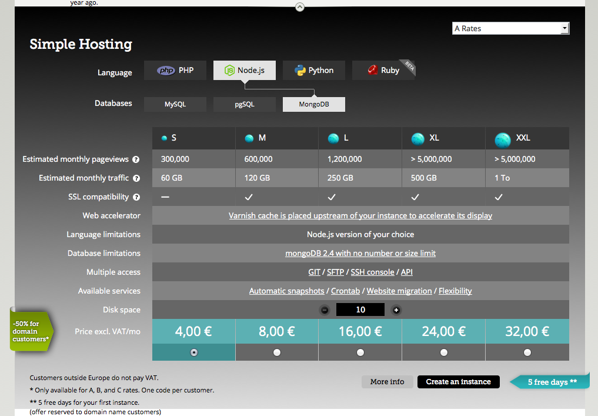

=== Gandi.net

Gandi.net is a Domain name registrar and cloud hosting provider. They became very famous in developer circles for their no-bullshit rules applied to everything, including their customer service.

Though Gandi's main product is domain registration and hosting, they don't really master good pricing here – it is highly competitive and complex. But on their mid-level Platform-as-a-Service-Hosting solution, they do the job very well. Let's take a look on what how they are doing it. With that service you can easily deploy PHP, Python, Node or Ruby project on one of three pre-selectable database engines without having to bother too much about setup and configuration.Here's what their plans overview looks like:

Do you remember when we talked earlier about having a low-end-base-price that is okay and totally fine but misses _one_ important feature? Take a look at the difference between the plans S and M. Not only is M double the size but more importantly S doesn't support SSL at all. Even if you are just running a rather small website, as long as there is some handling of sensitive information, you want SSL-Support. So without further notice only M and higher are of interest to you.

As previously stated, Gandi is very proud about their "no bullshit" rule. Which they also applies to this screen. It is clean and clear, the prices are full numbers and are practically bound to the fact you get double the service. But do you? The switch from M to L, though costing the double actually gives you more than just double. Sure, 250 GB is only 10 GB more than twice the 120 that M offered, but it is more none the less. And though subtle, if you are really checking the prices, you will notice and it will make you curious what they do at the next plan. Where they – all of the sudden – don't only offer the expected 2.4M page views but **over** 5M. And for a price just about 50% more than L. M already looked like the better offer already, but now XL just became the real bargain on this page.

Briefly I'd like to mention that the increasing the disk size does increase the price transparently about the same amount on all prices (90¢ per 5GB). And on the top right, you can configure the discount you get after you've been doing business with them. Clean and clear, no bullshit and still applying a good pricing scheme
