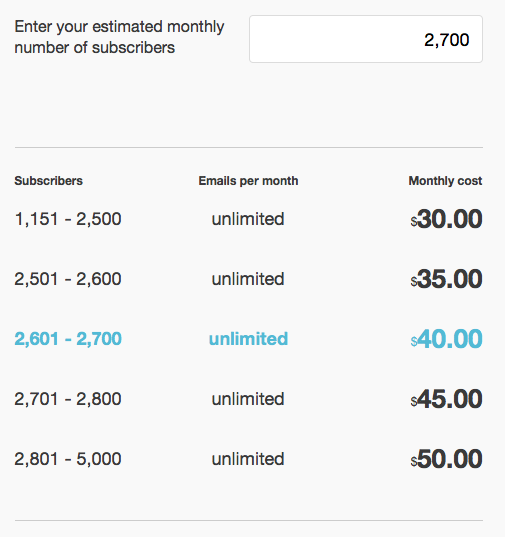

=== MailChimp

MailChimp is an email marketing service company, known for its really cute marketing with all kinds of monkeys. Right from its beginning in 2001 MailChimp has only been available as an online service. Aside from email-delivery and tracking they are praised for enabling their customers to create good looking and well working email newsletter through a very empowering user interface. Let's take a look at their pricing system. This is what you see, when you click on the main menu item "pricing":

image::image/mc-pricing-overview.png[scaledwidth="80%",align="center",alt="Mail Chimp's Pricing Overview"]

Before talking numbers, MailChimps makes you rethinking what business you are and what kind of service you'll need. Are you an entrepreneur, requiring up to 12k emails a month? Or a growing business with higher demands? Or are a fortune 500 in need to have huge demands full filled? Did you notice how they changed the conversation from money to a conversation about the customer and their needs? You aren't thinking about what prices are appropriate or what you are willing to pay, you are thinking about your business and its needs. Only after you've opted in describing your request a little more you will be presented with an actual offer. Let's take a look at those, each one by one.

==== The Entrepreneur

MailChimp is using a very positive language everywhere. Even when talking about the long-tail, the part of business that is of low volume, they are using terms that make the customer feel good and special. Being small is bad, being an aspiring entrepreneur is good. This is also transferred when you look at the page after selecting you were an entrepreneur:

Clean and clear and still not really about numbers. MailChimp really internalised the understanding that the pricing page is still a part of selling and marketing their service to the customer. As a result, this page, too, has comparably a lot of text and tries to convince you about their service and how it is totally suited for you and your business case. The only thing it really features is one big red button telling you their service is free for you. Which is something they, as with so many Software-as-a-Services, can afford easily. Once self-signup is in place, the costs per new customer are almost non existent – in case of MailChimp, sending another 12k emails a month isn't a bother at all for their platform.

There is one number on this page though. It says 10$/month. Which, supposedly, is the upgrade the entrepreneur has to take into account once they want to expand the business. That is really not much money and most will just click through here. What this paragraph shows though, is the previously also mentioned one-feature-missing-plan. Did you see that there is a link saying that some features are only available to paid accounts? Most people won't notice that long before they are used to using the service already. Let's take a look at those features.

===== Forever free vs. Paid only

As the "Pricing/Entrepeneur"-Page is still trying to sell you their service, the actual feature-sheet is hidden behind another page explaining the differences between the free and the paid service and the features you might have with those:

image::image/mc-forever-free.png[scaledwidth="80%",align="center",alt="Mail Chimp's Forever Free vs Paid Features"]

Looking at this page, you'd come to the conclusion that there isn't much difference between free and paid plans regarding features. The few marked with the x most customers won't even know their meaning of. But it is exactly those features many people are willing to pay for, once they discover them within the service. Delivery by Time Zone for example allows you to schedule messages so that they appear in the users Inbox for the most promising time to be read and Email-Client-Testing allows you to easily figure out whether the created email might be considered Spam and how it will look like in a variety of email clients. Both very interesting feature to increase the engagement of readers. And if you want any of them, you immediately have to pay for them and move into the category of "growing businesses".

==== Growing Business

image::image/mc-growing.png[scaledwidth="80%",align="center",alt="Mail Chimp's Growing Businesses"]

The first screen really talking about numbers – for once repeating once more that there is a free plan. And though there are numbers you can see that MailChimp focusses on clear communication. By splitting the screen into two equal half one containing an tool helping you pick your "plan" and the other promoting their features and praising the service. Reading through it you will notice that it is quite different compared to the entrepreneur-page though. And that is what makes this split so clever:

While they could have easily promoted their free-plan using this very screen, by asking the viewer before hand who they are, they are segmenting potential customer to present them with for them tailored promotion. Just take a look again what they are telling an entrepreneur why MailChimp is the best tool for their job in comparison with this screen again. Now try to fit both on the same page without making it confusing or overloading. But if you think of the different cases that people come with, this split feels rather natural. This screen would probably be not as convinced to someone starting their startup as the entrepreneur screen is.

Let's take a look onto the left and how they communicate the numbers. It starts from the top by asking you, again, to think about your business by having to enter the number of subscriptions you are expecting to need. Depending on it, the tool recalculate and highlight the appropriate packages beyond. You can't see it in the screenshot, but this area is automatically refreshing every time you enter something in the field.

A feature highly necessary as the pricing scheme itself is rather complex and wouldn't fit onto one explanatory paper. While the price increases by 5$ per step, you'll notice the limits do not increase in equal steps. The system is overall rather complex (you can find the full json at http://mailchimp.com/pricing/rates.json ) but in its essence it's taking small increases per 5$-step for a few times and then takes a big leap towards another even number. For example if we look at the 2.700 targeted subscriptions we have a sweet spot that show this very clearly:

We have one step from 1.500 to 2.500 then gradually get another 100 subscriptions per 5$-step but with 50$ we can even get up to 5.000. This has the effect that even if you type in 2.700 now, you'd see that with only 10$ more you'd be covered for almost double. Which sounds very convenient and  – in comparison – as a bargain. Without this handy tool, though, you wouldn't have picked this number, nor would you've ever understood which one to take in the first place.

There are two more interesting things to note here. First, the limit on emails you can send doesn't seem to apply any longer for you are running a paid plan – those all seem to be unlimited. Secondly that this only goes until a certain amount. Once you surpass the number of 50k subscriptions, the tool will inform you that you probably want to take a look into the high-volume-category and you'll find the limitation again:

Once more you can see the steep increase for just 5$ while making a big leap from 32k-50k. Obviously this is because 50.000 is the border at which MailChimps considers you a "high volume" business and wants to talk to you in a different way on the other page. Before we go there, let's take a quick look to the bottom part of the page and their second text-field.

Not all growing businesses do have a big demand on regularly sending out huge amounts of emails. But maybe you want to import a list of 5.000 subscriptions whom you send an email once a year or so. In this case, MailChimp offers you to buy credit instead of opting into a subscription model. This credit is then deducted on a pay-as-you-go-basis. In this tool based on the credit you purchase, the price per email decreases in steps, giving you more value per buck. But again in a fashion that is too not transparent that you could easily figure it out without their tool.

==== High Volume Business

On first glance, you'll immediately notice a highly different approach in communication and why MailChimp wanted you to switch to this page if you had more than 50k subscriptions.

At this scale of operation, we are talking big, multi-billion dollar business. This page is three times as long as the others. It features customers and their stories, including testimonials and logos of companies successfully using their service. It talks about the security certificates they have, praise the reliability and the API. And, on the bottom, they offer you contact form – something they didn't offer us before.

In the left column we have our price calculation tool again and we'll find a second reason why they wanted us to switch to this view. Remember that with 50k the monthly-email-limit came back? That was awkward, especially since a major selling point for the growing business was the lack of that limit. But over here, MailChimp makes the amount of emails a default part of the conversation. Customers are asked about the emails they are sending, not only their subscriptions.

The tool itself otherwise stays the same and has the same data basis behind it. And though the user would therefore see the same numbers, they are in different ballparks and will probably never notice that limit-no-limit-barrier, which solely exists to make more profits for MailChimp. By separating the groups early on, MailChimp successfully avoids this awkward discussion.

Another things we see right under the tool in the left column is a promotion for their other service, called Mandrill. With such huge demands it is very likely the customer already has a tool manage their lists as well as to create the emails. And their primarily concern to research MailChimp will probably be on the aspects of reliability in delivery and tracking. This is why they highlight the API as well as show this advert for their API-driven on-demand Mail-Delivery product here.

==== Conclusion

Through a smart market segmentation, MailChimp is able to offer custom tailored communication in the pricing process. Through the usage of a customer-needs-oriented tool, they are even able to provide a rather complicated pay-as-you-go pricing scheme in a easy and accessible manner. The most impressive though is how through this way of communication, they are able to generate great pricing offers to fortune-500 as well as freelancers in the same scheme.
