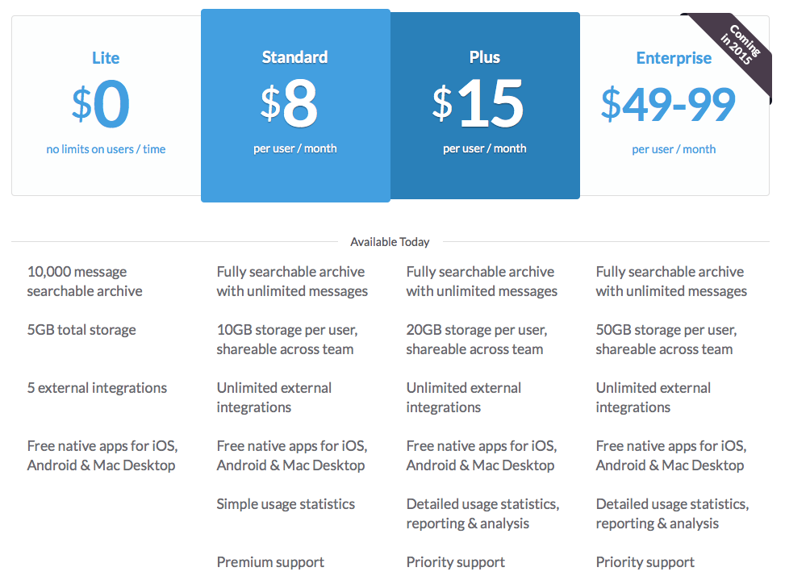

==== slack.com's pay-as-you-go-pricing

In this chapter I've talked a lot about Amazon and their Web-Services as the pioneers of this model of payments. This started a few years ago though and other have picked it up meanwhile, too. I'd like to discuss with you another really great example as a case-study for pay-as-you-go-pricing with plans: slack.com.

Slack is a internet messaging services for teams. It offers web-browser-based chatting over multiple rooms, while also being accessible through the established chat protocols XMPP and IRC, which lead to a high adoption in programmer circles (as they can stick with their own preferred chat clients). Slack's target market clearly is toward programming and communication teams within tech and internet companies and organisations. This also get very clear in their pay-as-you-go-planed pricing scheme:

As mentioned before, they also offer a free plan, allowing one to set up without any further questions and use their service right away – one of the many benefits of SaaS. Compared to the other plans it is clearly visible what you'd get for your buck on top: more storage and archive size and - this is important - more external integrations. On top for every higher plan there is also more support.

Why is this "pay as you go", one might ask. Because from "standard" on, the company is paying _per user_ per month. The bigger the team, the higher the payment. That's something you might haven't noticed initially as this is communicated in a subtle but clear way. Because when trying it out one only skims over the other pricing to make sure they aren't absurd. A quick glimpse says it costs 8$/months. A price is totally okay if you ever want to upgrade, so testing is safe. Converting more and more people over into the project and suddenly you have five or ten people in it. Remember you are still on the free "Lite"-plan. This is where the "external integration" limit is such a genius move.

External services are features slack.com offers to have third party information automatically be shown inside slack's conversations. This could for example be reports from your Project Management Tool or Version Tracker, they have support for Jira, Mailchimp, Github, Bitbucket and about fifty more at the time of writing. These integrations, though you initially don't even know what they are, quickly become very useful for the teams to stay up to date through their conversations. Many teams will just start with one or two integrations but over time the team grows and so does the amount of tools used – -maybe a Jenkins Instance is added and Trello for Todo List). Inevitably the customer will run into the 5 integrations limit.

At a time when the team most likely already has many more members, too. And it is only by then that the team realises, to have more external services will immediately cost them _8$ per user per month_. With 15 people they have on board now, this is a steep zero to 120$ a month. Though this is a lot, it would be much harder to change to a different tool now that this one is adopted. With 15 people on the team 120$ a month isn't too bad to pay for either and they will do it. The reason I am pointing this out is, that this feature also acts as an post-trial upselling argument here, similar to the way we've discussed them before. When one starts using slack.com, many don't even know what these external services are but with the successful team during the trial period one quickly learns to appreciate this feature to the point that it became the argument to pay 120$ more a month for them. This really shows the slack teams knows their product and their numbers and tailored the pricing scheme accordingly.

In a similar way storage space between standard and plus works. It will take quite a while before people really run out of space. But once they do, there is no turning back of the previously mentioned features. And you notice the price is less than double from standard to plus? Though you get twice as much storage? And even more detailed usage reports? And these usage reports are key again. As the one paying the bill for this service in the end will be a company. And companies like to create structures, hierarchies and monitor their employees for some reason. I bet the usual monitoring in standard isn't quite enough for your boss to track your actual productivity and they feel like they miss something. When the team is big enough though, slack offers you for _just a little more money_ to have way more control with the next plan.

All that while making more and more money on their customers growing their team, aka participating on their success. Pay as you go with plans as pretty as it can be. Genius.

